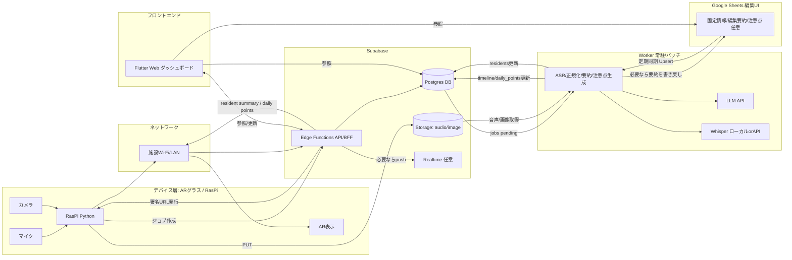
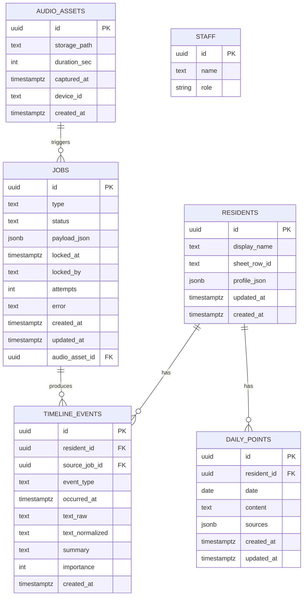
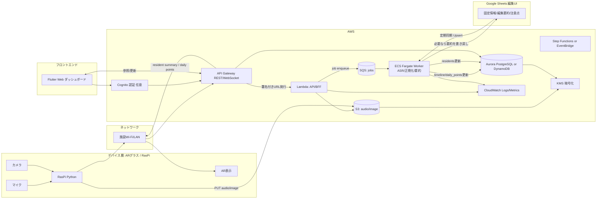

# 全体アーキテクチャ

申し送り

音声DB()→Whisper→

インカム会話ないよう

### 6-2. 技術スタック

- デバイス層
    - Raspberry Pi / AR グラス
    - OS: Ubuntu Server
    - 言語: Python
    - 機能：
        - マイク入力 (`arecord` / `pyaudio`)
        - 音声エンコード (`ffmpeg` / `pyav`)
        - カメラ入力（`libcamera` / `opencv-python`）
        - HTTP クライアント（`requests` / `httpx`）
        - WebSocket クライアント（`websockets` / `websocket-client`）
- バックエンド層
    - 言語: TypeScript
    - 実装候補: Node.js + Express / AWS Lambda + API Gateway / Supabase Edge Functions など
    - API:
        - `/audio/stream` → WebSocket → `audioSvc`
        - `/images` → POST → `imgSvc`
        - `/residents/{id}/summary` → GET → `residentSvc`
        - `/timeline` → GET/POST → `timelineSvc`
        - `/records` → GET/POST → `recordSvc`
    - スプレッドシート連携：
        - Google Sheets API もしくは GAS 経由でアクセス
        - 固定情報／要約テキスト／「今日の注意点」等を読み書き
- フロントエンド層
    - Flutter（Web）
    - Material Design 3
    - 状態管理: Riverpod など
    - 機能：
        - 利用者一覧・詳細表示
        - タイムライン閲覧
        - 「今日気をつけるべきポイント」の表示
        - 将来的に管理者用画面（スプレッドシートと DB の状態を確認）

### 6-3. データ保存戦略（重要）

- **Google スプレッドシート**
    - 固定情報（性格・傾向・なだめ方・持病 等）
    - 申し送り要約テキスト
    - 「今日気をつけるべきポイント」
    - 職員が直接編集できるようにする（PC 前提）
- **DB（Supabase / AWS RDS 等）**
    - タイムラインイベント（いつ／誰が／誰について／どのような内容）
    - バイタル履歴
    - イベント種別（申し送り・インカム・観察メモ 等）
- **ストレージ（Supabase Storage / S3）**
    - 申し送り音声の元データ（バイナリ）
    - 必要に応じて画像データ（様子の記録など）

### 6-4. 環境

- 環境種別
    - dev: 開発環境
    - stg: ステージング
    - prod: 本番環境
- 各環境ごとの詳細な構成・デプロイ手順は **infra リポジトリの README** に記載する。

### アーキテクチャAWS版

